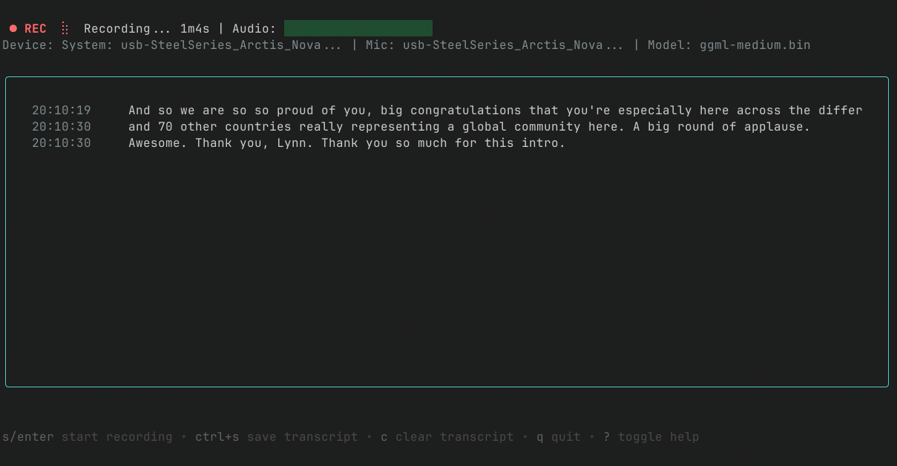

# Rekord

A Go TUI application for real-time meeting transcription using local speech-to-text. Works with any meeting application by capturing system audio.

## Features

- Captures system audio using PulseAudio/PipeWire monitor sources
- Works with any meeting application (Zoom, Meet, Teams, Discord, etc.)
- Fully local transcription using [whisper.cpp](https://github.com/ggml-org/whisper.cpp) - no API calls, no data sent anywhere
- Real-time transcription display with audio level visualization
- Save transcripts to text files
- Beautiful TUI interface built with Bubble Tea



## Requirements

### System Dependencies

```bash
# Fedora
sudo dnf install portaudio-devel pipewire-pulseaudio gcc-c++ make

# Ubuntu/Debian
sudo apt install portaudio19-dev pulseaudio-utils build-essential

# Arch Linux
sudo pacman -S portaudio pulseaudio-utils base-devel
```

### whisper.cpp

You need to install whisper.cpp for the transcription engine:

```bash
# Clone and build whisper.cpp
git clone https://github.com/ggerganov/whisper.cpp
cd whisper.cpp
make

# Install the binary
sudo cp build/bin/main /usr/local/bin/whisper
```

### Download a Model

Download a Whisper model from [Hugging Face](https://huggingface.co/ggerganov/whisper.cpp/tree/main):

```bash
# Create models directory
mkdir -p ~/.rekord/models

# Download base English model (recommended default)
wget -P ~/.rekord/models https://huggingface.co/ggerganov/whisper.cpp/resolve/main/ggml-base.en.bin
```

For more context regarding model selection, see the [whisper.cpp model files instructions](https://github.com/ggml-org/whisper.cpp/tree/master/models#available-models).

## Installation

```bash
# Install via Go
go install github.com/exler/rekord/cmd/rekord@latest
```

Download a prebuilt binary from GitHub Releases:

https://github.com/exler/rekord/releases

Or build from source:

```bash
# Clone the repository
git clone https://github.com/exler/rekord
cd rekord

# Build
go build -o rekord ./cmd/rekord
```

## Usage

```bash
# Run with default settings (uses default audio monitor and base model)
rekord

# Specify a different model
rekord -model ~/.rekord/models/ggml-small.en.bin

# Specify a specific audio device
# Use `pactl list sources short` to find the correct monitor source for your system
rekord -device alsa_output.pci-0000_00_1f.3.analog-stereo.monitor
```

### Development

```bash
go run cmd/rekord/main.go
```

## Configuration

Environment variables:

- `WHISPER_PATH`: Path to the whisper.cpp executable (default: searches in PATH and common locations)

Command-line flags:

- `-model`: Path to the Whisper model file
- `-device`: Audio device name (use `pactl list sources short` to list)
- `-output`: Output directory for saved transcripts

## License

`Rekord` is under the terms of the [MIT License](https://www.tldrlegal.com/l/mit), following all clarifications stated in the [license file](LICENSE).
